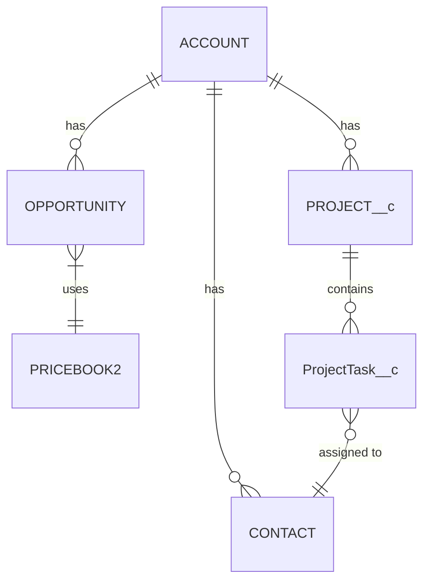

# Salesforce Data Model Designer

Design, review, extend, and validate Salesforce data models with ERD generation and platform limit checks.

## Arguments

- `design` — start a new data model design from scratch
- `review <org-alias>` — review an existing org's data model
- `extend <org-alias>` — design additions to an existing data model
- `validate` — validate a data model against platform limits

## Workflow

### Step 1: Entity Discovery

Ask the user to describe their business entities (use AskUserQuestion pattern). For each entity capture:
- Name, purpose, key attributes, relationships to other entities

If an org alias is provided (`review` or `extend` mode):
- Query existing objects via `salesforce_search_objects` or `sobject_list` to show what already exists
- Use `salesforce_describe_object` or `sobject_describe` to inspect fields and relationships on key objects
- Present the current state before proposing changes

Map each entity to:
- **Standard Object** if a good fit exists (Account, Contact, Opportunity, Case, Lead, Product2, etc.)
- **Custom Object** only when no standard object covers the use case

Always prefer standard objects over custom objects. Document the reasoning when choosing custom over standard.

### Step 2: Relationship Design

For each pair of related entities, determine the relationship type:

| Type | When to Use |
|------|-------------|
| Lookup | Loose coupling, independent lifecycle, optional relationship |
| Master-Detail | Tight coupling, cascade delete needed, roll-up summaries needed |
| Junction Object | Many-to-many (two master-detail fields on a junction custom object) |
| External Lookup | Reference to data in an external system |
| Hierarchical | Self-referencing on User object only |

Challenge anti-patterns:
- Over-use of master-detail where lookup suffices (locks reparenting, forces cascade delete)
- Missing junction objects for many-to-many (using text fields or multi-select picklists instead)
- Circular dependencies between master-detail chains
- Exceeding 5-level relationship depth (SOQL traversal limit)

### Step 3: Field Design

For each object, list key fields with: API name, type, required, unique, indexed, external ID.

Apply Salesforce field type mapping:

| Business Concept | Salesforce Type | Notes |
|------------------|-----------------|-------|
| Short text | Text(255) | Default max 255 chars |
| Long text | Long Text Area | Up to 131,072 chars |
| Number | Number | Specify precision and scale |
| Money | Currency | Inherits org currency settings |
| Percentage | Percent | Stored as decimal |
| Date | Date or DateTime | DateTime includes time + timezone |
| Yes/No | Checkbox | Defaults to false (unchecked) |
| Reference | Lookup or Master-Detail | See Step 2 |
| Fixed choices | Picklist | Use Global Value Set for shared values |
| Multiple choices | Multi-Select Picklist | Avoid for reporting-heavy fields |
| Calculated | Formula | Specify return type (text, number, date, checkbox) |
| Auto-generated ID | Auto Number | Format: `{PREFIX}-{00000}` |
| Rich content | Rich Text Area | Up to 131,072 chars with HTML |

Flag fields that should be indexed:
- Fields used in WHERE clauses of common queries
- Fields used as report filters
- Fields with high selectivity (< 30% of records match)
- External ID fields (auto-indexed)

### Step 4: Platform Limit Validation

Validate against hard Salesforce limits:

| Limit | Value | Notes |
|-------|-------|-------|
| Custom objects per org | 2,000 (2,200 with permission) | Includes managed package objects |
| Custom fields per object | 500 | Standard objects may have lower limits |
| Total fields per object | ~800 | Standard + custom + system |
| Lookups per object | 40 | Includes both lookup and master-detail |
| Master-Detail per object | 2 | 3 allowed on junction objects |
| Relationship depth (SOQL) | 5 levels | Parent-to-child traversal |
| Relationship queries per SOQL | 20 | Subqueries in a single SOQL statement |
| Record types per object | 600 | Per object limit |
| Roll-up summaries per object | 25 | On master side of master-detail |
| Sharing rules per object | 300 | Criteria-based + ownership-based |

Query Context7 for current limits:
```
mcp__context7__query-docs with libraryId="/damecek/salesforce-documentation-context"
query: "salesforce object field limits governor custom object maximum"
```

For `review` and `extend` modes, compare existing counts against limits to calculate headroom.

### Step 5: ERD Generation

Generate a Mermaid ERD diagram following these conventions:
- Standard objects in UPPER_CASE (e.g., `ACCOUNT`, `CONTACT`)
- Custom objects in PascalCase with `__c` suffix (e.g., `ProjectTask__c`)
- Show relationship cardinality using Mermaid notation
- Group by functional area if more than 10 objects (use Mermaid subgraphs or comments)

Example:


Relationship notation:
- `||--o{` = one-to-many (required parent)
- `|o--o{` = one-to-many (optional parent / lookup)
- `}o--o{` = many-to-many (show junction object explicitly)

### Step 6: Output Generation

Compile the full data model document.

## Output Format

```markdown
# Data Model Design
## Project: <name>
## Date: <date>

### 1. Entity Summary
| Object | Type | Purpose | Record Type(s) | Est. Volume |
|--------|------|---------|----------------|-------------|

### 2. Entity-Relationship Diagram
[Mermaid ERD from Step 5]

### 3. Object Detail

#### <Object Name>
- **Type**: Standard / Custom
- **API Name**: `Object_Name__c`
- **Purpose**: ...
- **Fields**:

| Field | API Name | Type | Required | Indexed | Notes |
|-------|----------|------|----------|---------|-------|

- **Relationships**:

| Related Object | Type | Field API Name | Cascade Delete? |
|----------------|------|----------------|-----------------|

- **Record Types**: (if applicable)

### 4. Platform Limit Assessment
| Limit | Current | Proposed | Headroom | Risk |
|-------|---------|----------|----------|------|

### 5. Design Decisions
- Why <entity> maps to standard vs. custom object
- Why <relationship> uses lookup vs. master-detail
- Junction object rationale (if any)
- Record type decisions

### 6. Implementation Notes
- Object creation sequence (parent objects before child objects)
- Fields that need population order (formulas depend on base fields)
- Recommended indexes for reporting performance
- Data migration considerations (if extending existing model)
```

## Important

- Always prefer standard objects over custom objects. Challenge "we need a custom object" assumptions.
- Master-detail is a stronger commitment than lookup. Default to lookup unless roll-up summaries or cascade delete are explicitly needed.
- Multi-select picklists are problematic for reporting. Prefer junction objects for many-to-many.
- Every custom object needs a clear owner (who maintains the data).
- Validate data volume estimates early. Objects expecting 10M+ records need selective query design from the start.
- For `extend` mode: never propose changes that break existing automation or reports without flagging the risk.
